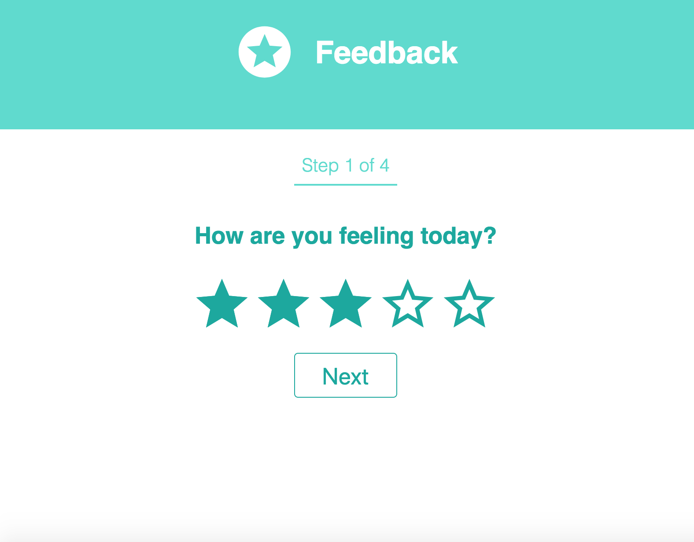
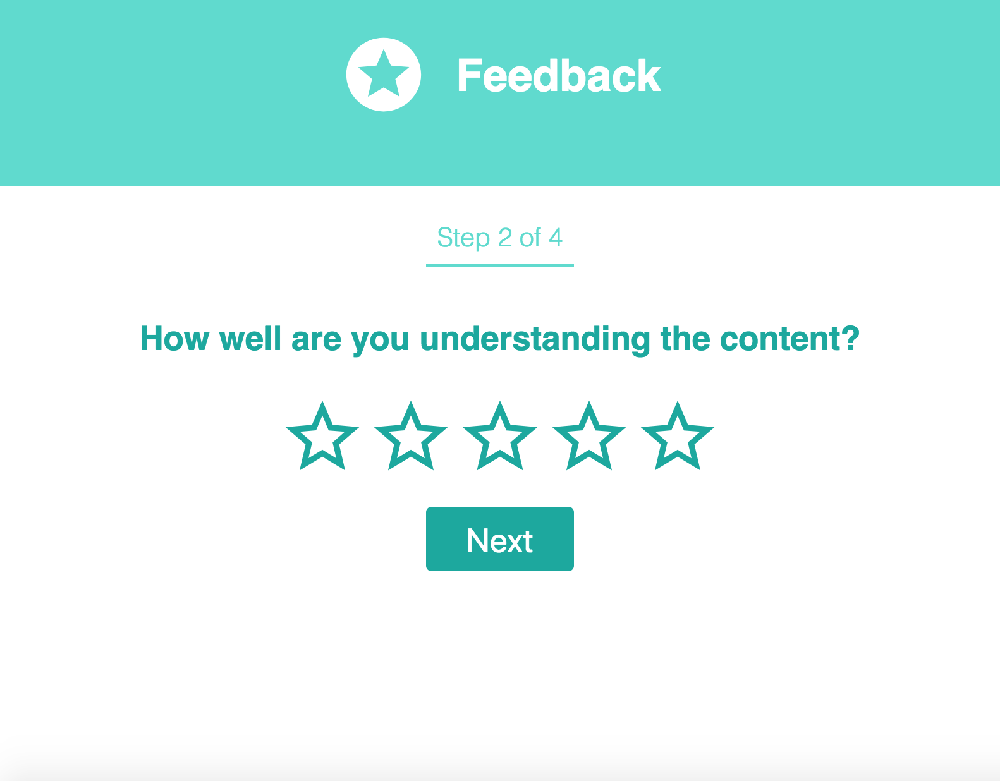
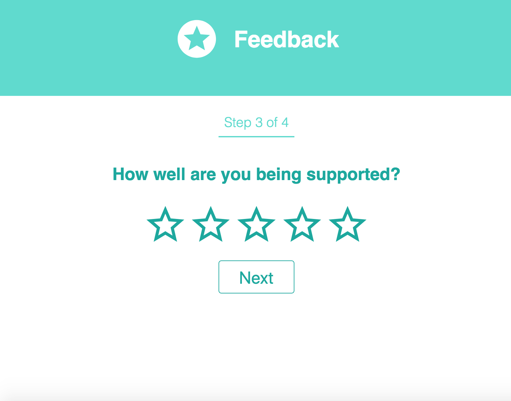
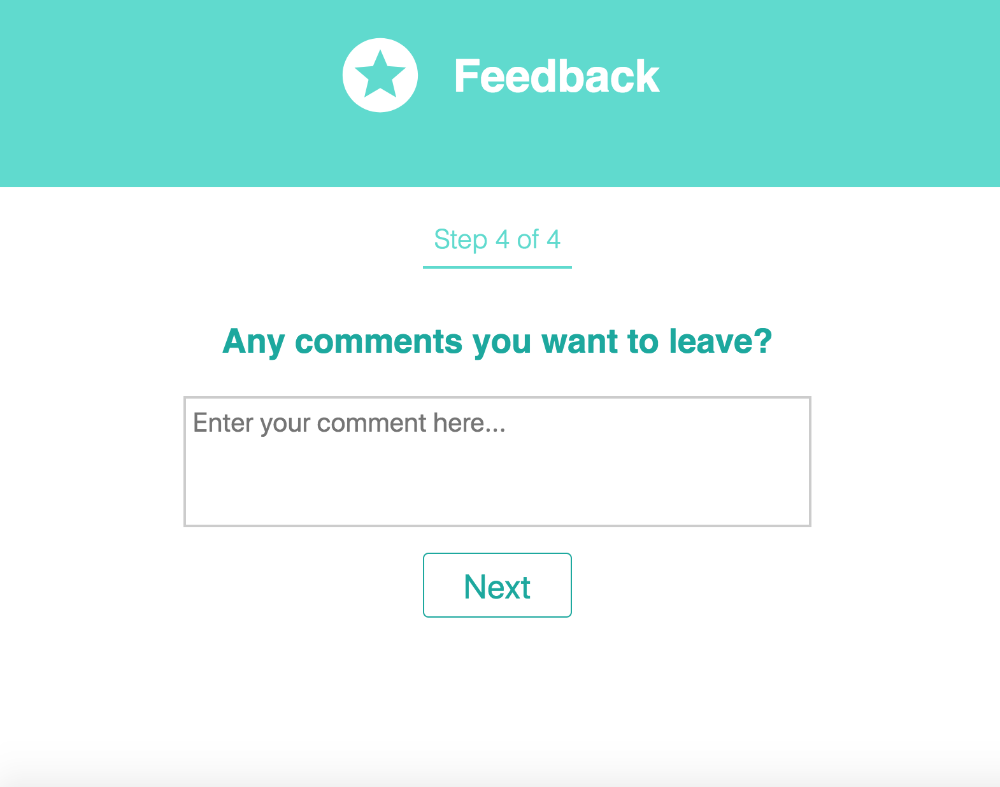
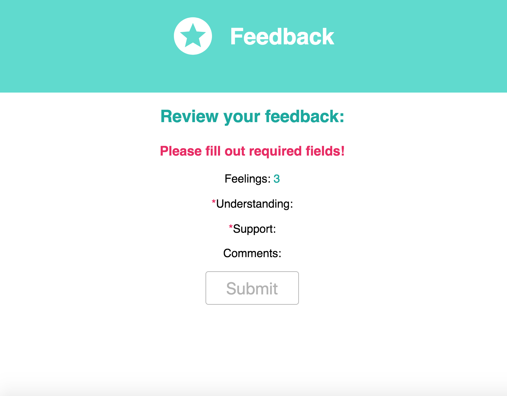
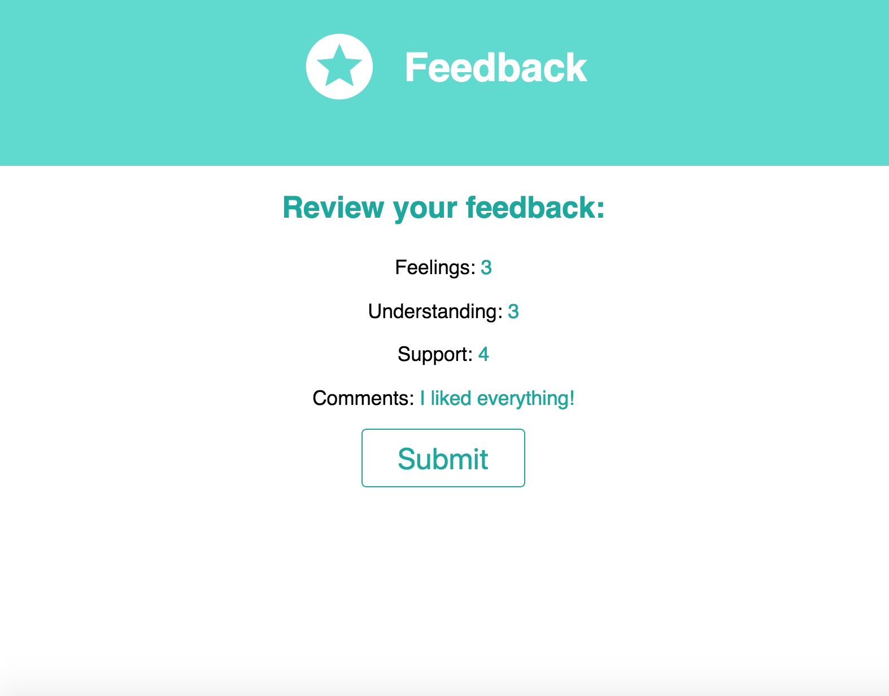
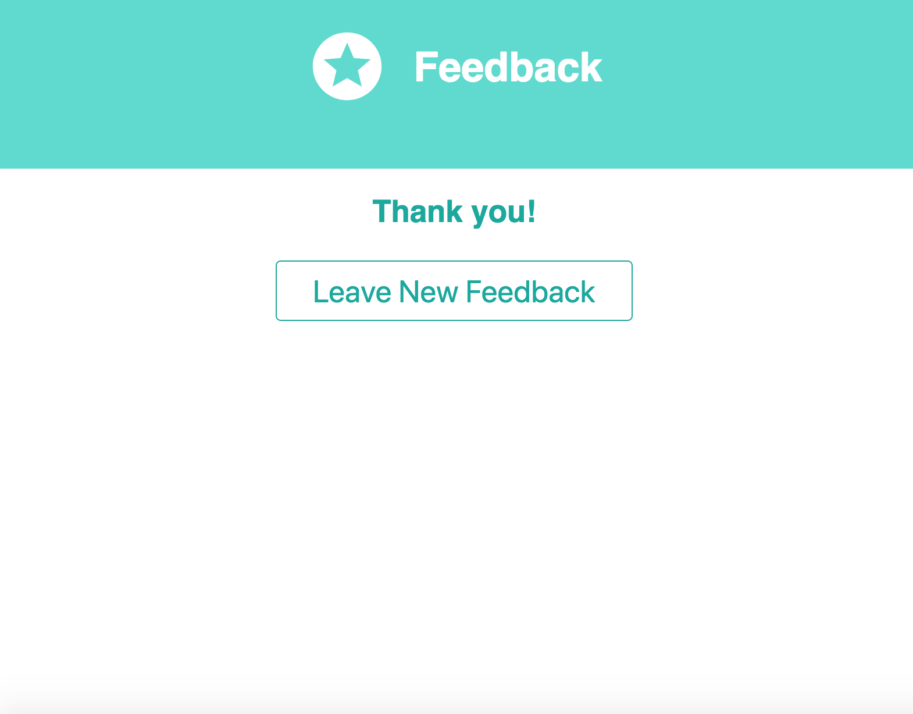
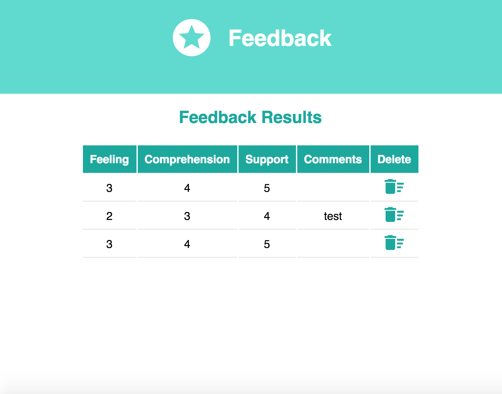

# Redux Feedback Loop

### SETUP

Create your database and tables using the provided `data.sql` file. Start the server.

```
npm install
npm run server
```

Now that the server is running, open a new terminal tab with `cmd + t` and start the react client app.

```
npm run client
```

### FEATURES

There will be 4 views for the form:

- How are you feeling today?



- How well are you understanding the content?



- How well are you being supported?



- Any comments you want to leave? (Not required)




### THE REVIEW COMPONENT

The review page will show the user entered responses for the survey. Required fields will have an asterik to notify the user what is missing from the survey.

### Incomplete, Submit button is disabled:



### Survey complete, Submit button is active:



### SUCCESS PAGE

The user will see the success page when the submit button is clicked. The survey responses are saved in the database. 



### ADMIN SECTION

The route `/admin` will display the existing feedback submitted from the database. The user can delete existing feedback. 



